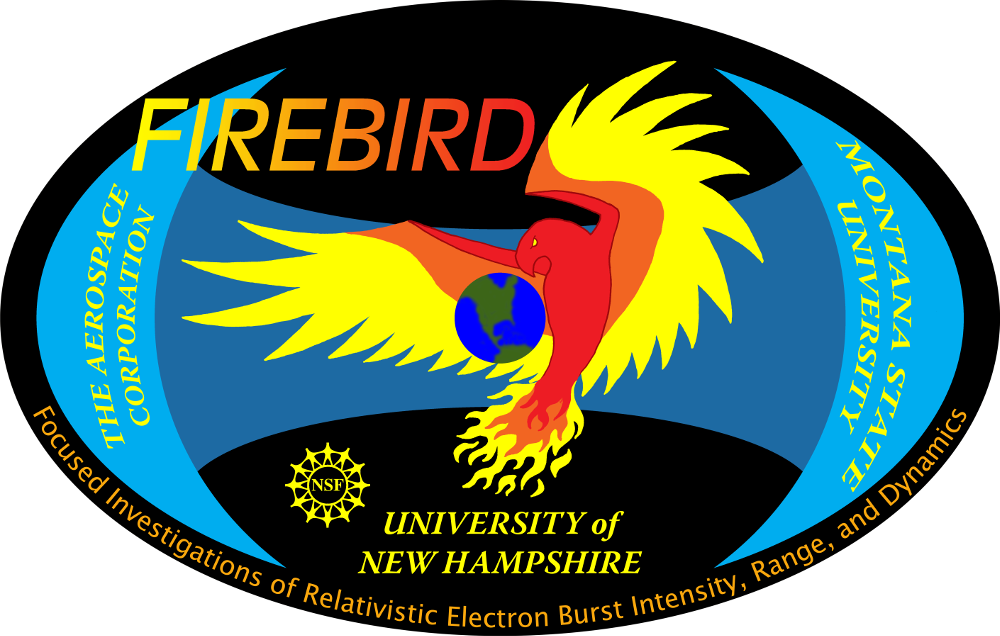
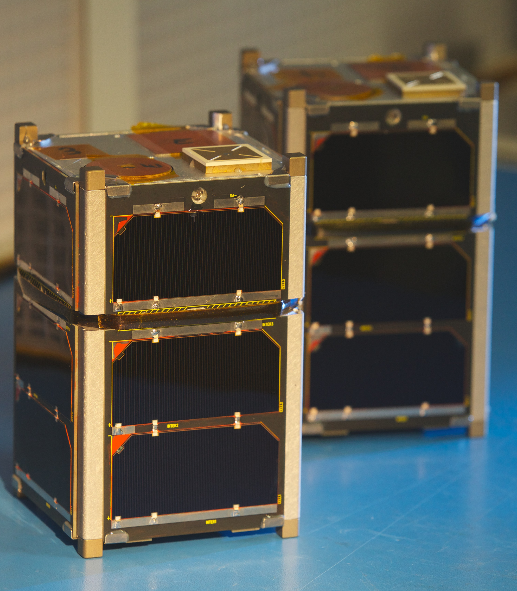

I am a PhD candidate in the physics department at Montana State University (MSU) in Bozeman, Montana. I am working with Dr. John Sample to study energetic particle precipitation into Earth's atmosphere. The central focus of my disseration is one type of particle precipitation called microbursts, a sub-second intense impulse of electrons obseved in low Earth orbit, upper atmosphere, and recently inside the radiation belts. My main interests include analyzing in-situ energetic particle data, modeling to understand the data, and understand & develop particle instruments.

## Current Projects
A unique advantage of working at the Space Sciences and Engineering Laboratory (SSEL) is that we have and are building space hardware e.g. CubeSats, balloon payloads, and sounding rocket payloads. One mission that my labmate Arlo Johnson and I have been commanding and operating are the pair of FIREBIRD-II CubeSats that are orbiting in low Earth orbit. FIREBIRD-II were launched on January 31st, 2015 and are operational to this day. They are equiped with silicon solid state detectors that are sensitive to electrons in the range of 200 - 1000 kilo electron Volts (keV). 

*The twin FIREBIRD-II CubeSats on the bench before launch*

## Research Interests

*Example animation of Bayesian linear regression using the Metropoplis Markov Chain Monte Carlo (MCMC) sampler. Red lines show the "true" line and blue dots are the observations from the "true" line assuming Gaussian noise. Each frame shows an iteration of the MCMC, and the final frame shows the final posteror histogram. Further details are in the [Reserach Section](www.stuff.com)*

## Athletics
Include Strava app here.