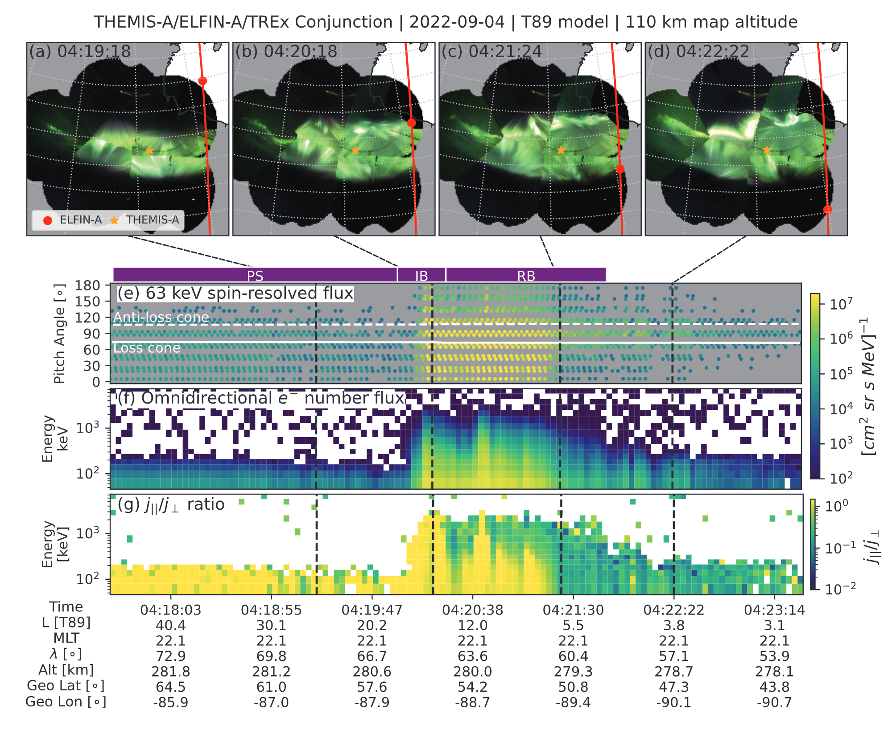

I study Magnetosphere-Ionosphere Coupling & Auroral Dynamics, with a focus on energetic (relativistic) particle precipitation from space into Earth's atmosphere using multipoint measurements---originally multiple satellites, and now including all-sky imagers stationed at high latitudes. With the space- and ground-based observatory perspectives, my scientific ambition is to understand physical phenomena as a system as it evolves in space and time.

<iframe width="560" height="315" src="https://www.youtube.com/embed/mgUZwoR0gcE?si=pYYvAKBrUJ63Py3O" title="YouTube video player" frameborder="0" allow="accelerometer; autoplay; clipboard-write; encrypted-media; gyroscope; picture-in-picture; web-share" referrerpolicy="strict-origin-when-cross-origin" allowfullscreen></iframe>

***Our sun's solar wind couples to Earth's magnetosphere via reconnection which then leads to a cascade of phenomena ending with the aurora. Credit: NASA***

## Current Projects
My scientific pursuit has three themes.

**First Theme: The High-Energy Tail of Pulsating Aurora.** Pulsating aurora is a form of aurora believed to be generated by wave-particle interactions between whistler-mode chorus and electrons in the magnetosphere. Similarly, relativistic electron microbursts are also believed to be scattered by chorus waves. Thus, a natural follow-on question is if the 10s keV and relativistic (>500 keV) electrons are part of the same underlying phenomenon. [Miyoshi+2020](https://doi.org/10.1029/2020GL090360) explicitly framed this hypothesis and confirmed its viability with the GEMSIS-RBW model. There are a few observations supporting this hypothesis. My contribution to this topic is twofold: 1) quantifying the ~100 ms duration of relativistic microbursts which are similar to the extensively-published ~300 ms period of pulsating aurora internal modulations [Shumko+2021a](https://mshumko.github.io/publications/shumko_2021a/), and 2) relating the two phenomena in space and time as in the [Shumko+2021b](https://mshumko.github.io/publications/shumko_2021b/) result.

<video class="responsive-video" controls autoplay loop>
  <source type="video/mp4" src="../images/20080116_105900_110127_themis_gill_map.mp4">
</video>

***A SAMPEX-THEMIS ASI conjunction showing the association between patchy aurora and >1 MeV electron microbursts. Figure reproduced based on [Shumko+2021](https://mshumko.github.io/publications/shumko_2021b/).***

Looking forward, I plan to study the relativistic microburst-pulsating aurora hypothesis statistically using the multitude of THEMIS ASI-SAMPEX conjunctions, and by developing the LAMPsat CubeSat mission (based on the recently flown LAMP sounding rocket) that will observe the aurora from low Earth orbit.

<video class="responsive-video" controls autoplay loop>
  <source type="video/mp4" src="../images/20220305_riometer_merged.mp4">
</video>

***A timelapse of the aurora that I took right before the LAMP sounding rocket launched from Poker Flat, Alaska on 5 March 2022. A University of Calgary riometer antenna is in the foreground.***

**Second Theme: Using isotropy boundaries to map the aurora to its magnetospheric sources.** Mapping auroral forms to/from their magnetospheric sources is highly uncertain because Earth's night side magnetosphere dynamically evolves on minute time scales. For example, in general we still do not know where auroral arcs map to in Earth's magnetotail, especially cases with multiple auroral arcs. Nevertheless, we can use unique phenomena for much more accurate mapping. [Nishimura+2010](https://doi.org/10.1126/science.1193186) and [Ozaki+2019](https://doi.org/10.1038/s41467-018-07996-z) show that correlating chorus wave amplitude with pulsating aurora is one way to validate mapping. Another way is to use electron and proton isotropy boundaries as tracers of the nightside transition region (NTR) between Earth's dipolar inner-magnetosphere and the magnetotail. In [Shumko+2025](https://mshumko.github.io/publications/shumko_2025/) we used a well-timed quadruple conjunction between THEMIS probes, TREx ASIs, ELFIN CubeSats, and a POES satellite to map the vibrant auroral bulge to the newly-dipolarized inner-magnetosphere.

***A ELFIN-TREx conjunction showing relativistic electrons observed on field lines that also connected to the auroral bulge. Figure from [Shumko+2025](https://mshumko.github.io/publications/shumko_2025/).***

Looking forward, I plan to apply this mapping technique to multiple substorms to test the hypothesis that the auroral bulge maps to the NTR. In the ionosphere this region maps in between the proton and electron isotropy boundaries.

<video class="responsive-video" controls autoplay loop>
  <source type="video/mp4" src="../images/20220904_042300_042800_mosaic.mp4">
</video>

***A POES-TREx conjunction showing relativistic electrons observed on field lines that also connected to the auroral bulge. The proton isotropy boundary (middle-right panel) corresponds to the equatorward edge of the auroral bulge, while the electron isotropy boundary (top-right panel) corresponds to the poleward edge of the auroral bulge. Figure adapted from [Shumko+2025](https://mshumko.github.io/publications/shumko_2025/).***

**Third Theme** is to understand the mechanisms that are responsible for plasma sheet electron acceleration to relativistic energies, and their subsequent scattering into Earth's atmosphere.

TBD!

**Advancing science through open-source software**

I am also working on my first comprehensive Python package called [asilib](https://aurora-asi-lib.readthedocs.io/). This project is the culmination of my learning journey to build a user-friendly library that allows a researcher to "easily download, plot, animate, and analyze auroral all sky imager (ASI) data." While working on this library I learned a whole lot including software engineering concepts as, simple software architecture, comprehensive tests, and useful documentation. Furthermore, I've learned a lot about the aurora and how it is analyzed. This work is deeply fulfilling, and I believe that we could use more software like this in space physics to reduce the barriers to entry for new scientists. They don't have to learn to do basic tasks including how to download or load the data: they can pip install `asilib` and immediately start working with auroral images.

<video class="responsive-video" controls autoplay loop>
  <source type="video/mp4" src="../images/20211104_trex_gps.mp4">
</video>

***Using asilib and clowncar to show the TREx ASIs with GPS CXD data, showing the arrival of relativistic electron fluxes concurrently to the "purple rain" reported by [Sorathia+2025](https://doi.org/10.1029/2025GL117469).***

## Probability Theory
Besides analyzing time series and image data to study microbursts and curtain precipitation, I develop models to link data to reality---or our best understanding of reality.

Broadly, I am interested in probabilistic methods such as Bayesian Inference (see my [2020](../_publications/shumko_2020a.md) and [2023](../_publications/shumko_2023.md) papers). I am very interested in these models because they allow a modeler to explicitly incorporate statistical and systematic uncertainty into model to make statistically-guided inferences about results. 

***Example animation of Bayesian linear regression using a hand-coded Metropoplis Markov Chain Monte Carlo (MCMC) sampler. Red lines show the "true" line and blue dots are the observations from the "true" line assuming Gaussian noise. Each frame shows an iteration of the MCMC, and the final frame shows the final posteror histogram.***

