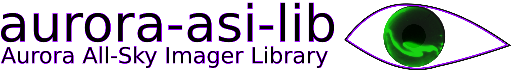
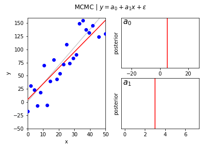

I study energetic particle precipitation from space into Earth's atmosphere using multipoint measurements---originally using multiple satellites, and now using all-sky imagers stationed in Canada and Alaska. With multiple measurements of the same physical phenomena, it is possible to isolate its properties in space and time. Furthermore, multiple space- and ground-based observatories help us understand the bigger picture. 

## Current Projects
Recently, my research pivoted to studying a type of diffuse aurora called pulsating aurora. This form of aurora is believed to be generated by wave-particle interactions between whistler-mode chorus and electrons in the magnetosphere. Microbursts are also believed to be scattered by chorus waves. Both phenomena have two distinct time frames: microbursts typically come in bunches lasting up to 10 seconds while pulsating aurora has an on-off periods lasting about the same time, and individual relativistic microbursts [last ~100 ms](https://mshumko.github.io/publications/shumko_2021a/) while pulsating aurora has internal modulations with a 300 ms period. The closeness of these two time scales, along with other arguments I present [here](https://mshumko.github.io/publications/shumko_2021b/), presents a compelling case that pulsating aurora and microbursts are part of the same phenomena. That said, I am now searching multiple data sets and looking for the hypothesized signature that could confirm this link.

I am also working on my first comprehencive Python package called [aurora-asi-lib](https://aurora-asi-lib.readthedocs.io/). This is my first attempt to build a user-friendly library that allows a researcher to "easily download, plot, animate, and analyze auroral all sky imager (ASI) data." While working on this library I learned a whole lot including software engineering concepts as, simple software architecture, comprehensive tests, and useful documentation. Furthermore, I've learned a lot about the aurora and how it is analyzed. This work is deeply fulfilling, and I believe that we could use more software like this in space physics to reduce the barriers to entry for new scientists. They don't have to deal with learning how to download or load the data: they can download  `aurora-asi-lib` and immediately start working with auroral images.

<video width="100%" max-height=500px controls autoplay loop>
  <source type="video/mp4" src="../images/20220305_riometer_merged.mp4">
</video>

***A timelapse of the aurora that I took right before the LAMP sounding rocket launched from Poker Flat, Alaska on 5 March 2022. A riometer antenna is in the foreground.***

<video width="100%" max-height=500px controls autoplay loop>
  <source type="video/mp4" src="../images/20070220_proton_aurora_microbursts.mp4">
</video>

***The SAMPEX satellite observed energetic electron microbursts (the spikes in the bottom panel) while it orbited above proton aurora on 20 January 2007.***

## Research Interests
Besides analyzing time series and image data to study microbursts and curtain precipitation, I develop models to link data to reality---or our best understanding of reality.

Broadly, I am interested in probabilistic methods such as Bayesian Inference (see my [2020 paper](https://mshumko.github.io/publications/shumko_2020a/)). I am very interested in these models because they allow a modeler to explicitly incorporate statistical and systematic uncertainty into model to make statistically-guided inferences about results. 

***Example animation of Bayesian linear regression using a hand-coded Metropoplis Markov Chain Monte Carlo (MCMC) sampler. Red lines show the "true" line and blue dots are the observations from the "true" line assuming Gaussian noise. Each frame shows an iteration of the MCMC, and the final frame shows the final posteror histogram.***

I am also interested in applying machine learning algorithms such as Artificial Neural Networks and Random Forests to my research. I am brainstorming a project that will use Random Forest regression and I will post updates as soon as we publish a paper that used it.