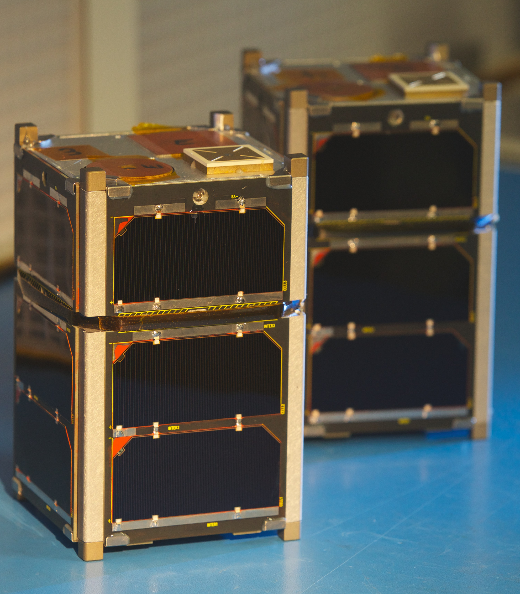

I study energetic particle precipitation from space into Earth's atmosphere using multi-spacecraft missions. With multiple measurements made nearby it is possible to study a variety of transient and persistent particle precipitation phenomena that is impossible with a single spacecraft. My PhD research focused on a type of transient electron precipitation into the atmosphere called microbursts, a sub-second intense impulse of electrons observed in low Earth orbit, upper atmosphere, and recently in the heart of the radiation belts. Microbursts have been estimated to deplete the outer radiation belt electrons as quickly as a few hours and affect atmospheric chemistry. My work on microbursts is highlighted in the [Publications](/publications/) section.

For my postdoctorial research I am studying a form of stationary and persistent precipitation called curtains. Curtains were recently discovered and little is known about them; curtains can persist for at least 65 seconds, and they are very small. So small, in fact, that a spacecraft will typically cross one in about a second, roughly ten kilometers in low Earth orbit.

## Current Projects
A unique advantage of working at the Space Sciences and Engineering Laboratory (SSEL) is that we have and are building space hardware e.g. CubeSats, balloon payloads, and sounding rocket payloads. One mission that my labmate Arlo Johnson and I have been commanding and operating for almost five years are the pair of FIREBIRD-II CubeSats that are orbiting in low Earth orbit. FIREBIRD-II were launched on January 31st, 2015 and are operational to this day. They are equiped with silicon solid state detectors that are sensitive to electrons in the range of 200 - 1000 kilo electron Volts (keV). 

The primary FIREBIRD-II science is to determine the spatial size and energy spectra of energetic electron microbursts shown below.

*The twin FIREBIRD-II CubeSats on the bench before launch, and examples of a microburst observed simulatenosuly by FIREBIRD-II where subsequent bounces were observed. More bouncing microburst deails are [here](/publication/bouncing_packet_paper_1).*

## Research Interests
One of my many interests is understanding how microbursts are scattered. My [dissertation](../files/shumko_dissertation.pdf) shows the work I've done over my grad career to understand how waves scatter radiation belt electrons to generate microbursts. Besides analyzing microburst time series data, I make models to link data to reality - or our best understanding of reality - and model how this reality will be measured by our imperfect measurments. One type of data analysis tool I've been learning is Baysian inference and Markov Chain Monte Carlo samping methods. Bayesian inference gives a modeler the flexibility to incorporate statistical and systematic uncertanity and understand their influince on the observations. 

*Example animation of Bayesian linear regression using the Metropoplis Markov Chain Monte Carlo (MCMC) sampler. Red lines show the "true" line and blue dots are the observations from the "true" line assuming Gaussian noise. Each frame shows an iteration of the MCMC, and the final frame shows the final posteror histogram.*
